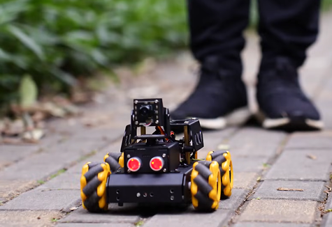

# TurboPi

English | [中文](https://github.com/Hiwonder/TurboPi/blob/main/README_cn.md)

<p align="center">
  
</p>

## Product Overview

TurboPi is an open-source AI vision vehicle based on Raspberry Pi, specifically designed for beginners. It features a Mecanum wheel chassis and is equipped with a 2-DOF high-definition wide-angle camera. By integrating the OpenCV vision library with the YOLOV5 deep learning framework, it enables multimodal perception and motion control experiments, efficiently completing AI functions such as color recognition, object tracking, autonomous driving, face and gesture recognition!

## Official Resources

### Official Hiwonder

- **Official Website**: [https://www.hiwonder.net/](https://www.hiwonder.net/)
- **Product Page**: [https://www.hiwonder.com/products/turbopi](https://www.hiwonder.com/products/turbopi)
- **Official Documentation**: [https://docs.hiwonder.com/projects/TurboPi/en/standard/](https://docs.hiwonder.com/projects/TurboPi/en/standard/)
- **Technical Support**: support@hiwonder.com

## Key Features

### AI Vision Functions

- **Color Tracking** - Recognize and track specified color objects
- **Face Tracking** - Real-time face detection and tracking based on MediaPipe
- **Gesture Recognition** - Gesture command recognition and response
- **Line Following** - Automatic line following navigation
- **QR Code Recognition** - QuickMark QR code detection and parsing

### Intelligent Control

- **Obstacle Avoidance** - Smart obstacle avoidance based on ultrasonic sensors
- **Mecanum Wheel Control** - Omnidirectional movement control
- **Remote Control** - Support for APP and network remote control
- **Pan-Tilt Control** - 2-DOF camera pan-tilt

### Programming Interface

- **Python Programming** - Complete Python SDK
- **RPC Interface** - JSON-RPC remote calls
- **Video Stream** - Real-time MJPG video streaming

## Hardware Configuration

- **Processor**: Raspberry Pi 4B or 5B
- **Mobility System**: Mecanum wheel omnidirectional mobile chassis
- **Vision System**: USB camera + 2-DOF pan-tilt
- **Sensors**: Ultrasonic distance sensor, 4-channel line following sensor
- **Actuators**: PWM servo, DC motor
- **Indicators**: RGB LED, buzzer

## Project Structure

```
turbopi/
├── TurboPi.py                  # Main program entry
├── Camera.py                   # Camera control
├── RPCServer.py               # RPC server
├── MjpgServer.py              # Video stream server
├── Functions/                 # Function modules
│   ├── ColorTracking.py       # Color tracking
│   ├── FaceTracking.py        # Face tracking
│   ├── GestureRecognition.py  # Gesture recognition
│   ├── Avoidance.py           # Obstacle avoidance
│   ├── LineFollower.py        # Line following
│   └── QuickMark.py           # QR code recognition
├── HiwonderSDK/               # Hardware control SDK
├── CameraCalibration/         # Camera calibration tools
├── lab_config.yaml            # Color recognition config
└── servo_config.yaml          # Servo configuration
```

## Version Information

- **Current Version**: v1.0.0 (2024-03-14)
- **Supported Platform**: Raspberry Pi 4B or 5B

### Related Technologies

- [OpenCV](https://opencv.org/) - Computer Vision Library
- [MediaPipe](https://mediapipe.dev/) - Machine Learning Framework

---

**Note**: This program is pre-installed on the TurboPi robot system and can be run directly. For detailed tutorials, please refer to the [Official Documentation](https://docs.hiwonder.com/projects/TurboPi/en/standard/).
